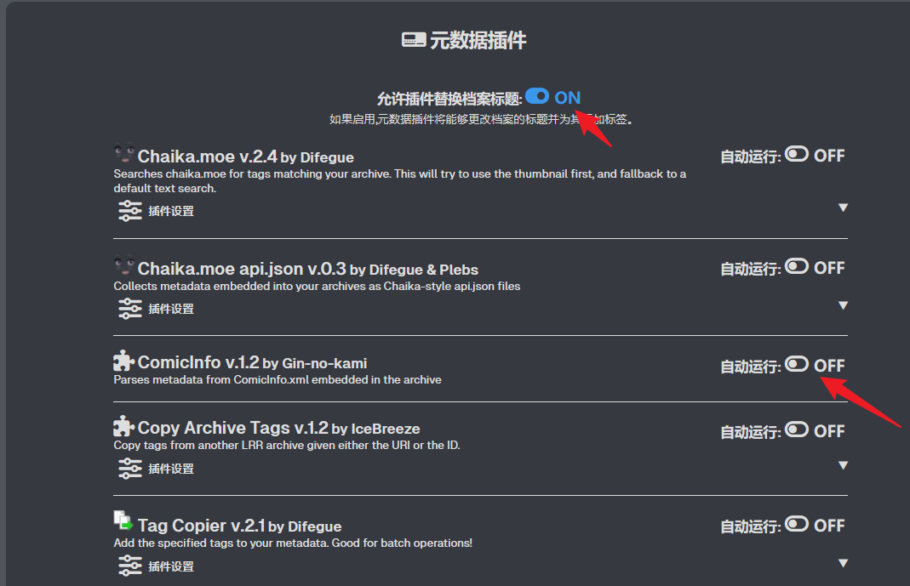

<div class="masked my-6">本子</div>

# 通过LANraragi实现Exhentai备份（元数据刮削）

- [x] 测试Tun Mode下 直接下载漫画后，LANraragi扫描后是否能够完成元数据的自动刮削 -> 后续下载可以直接在tun模式下进行.

在Tun模式下，下载到content的内容由LAnraragi设置中重新扫描后在主页可见，刷新后元数据自动刮削

- [x] Tun Mode 不起作用原因

在Clash首页中重新关闭Tun再开启后恢复，猜测可能设置中修改不起作用，必须在此处启用

- [x] 通过手机Ehviewer下载，使用FTP传输，LANraragi是否支持手机端Ehviewer的保存格式（能否正常刮削） 是否能通过FTP直接将本子下载到电脑

- [x] FTP 可以，但是如果使用windows共享文件夹呢，能否在Ehviewer上设置下载路径时直接选用外部（实在不行看看有线传输）

目前未解决，手机和电脑同时连Chinanet-edu无效，手机上看不见共享文件夹

通过在插件设置中开启允许替换标题与关闭Comicinfo 可以实现虽然Ehviewer下载的标题是以GID命名并且会有英文tag的问题 效果为自动保存标题与中文Tag



- [x] 测试Ehviewer已完成后的任务继续进程后会发生什么

已完成不继续下载

- [x] 找到开机自启脚本 关闭自带脚本？ 或者只是写一个带变量启动的脚本

  > 实现powershell 命令 `lanraragi` 设置临时代理环境变量 启动lanraragi

- [x] 版权本下载
- [x] 查询venera / picacomic 等软件的nheantai 版权本替代下载方案 (是否有cbz打包以及comicinfo功能) (如果没有则看是否能被lanraragi 插件识别)

- [x] 缩略图无法生成
  > 实在不行直接换docker或者重新配置msi试试
- [ ] rss订阅本子画师
- [ ] bangumi清点游戏漫画番剧收藏条目
- [x] 似乎不能在d盘eromanga安装lanraragi 明天重新配置好0.9.5,最好能检查出缩略图问题，否则试试安装在另一路径0.9.6 night lanraragi
      注意修改ua代理 ehentai 插件 /设置中tag rule配置适配nhentai
- [ ] 目前本子文件的传输不够优雅，未来优化
- [ ] 修改nHentai插件，早期下载的可能没有自带ComicInfo

# Procedure

## Download(mainly on phone)

- Ehviewer
  自带的下载功能,下载含有Comicinfo.xml文件的cbz压缩包,导入lanraragi content文件夹自动触发Ehentai tag插件,同时设置里的tag rule会在保存元数据之前启用(目前网络不稳定,不知道是不是机场质量的原因)
  同时插件会修改文件名

  > 注意修改Ehentai 官方插件的 ua代理

- Nhentai(应对版权炮/同时便于对画师其他作品查漏补缺)
  通过网站和Nhentai downloader插件,也可以下载含有Comicinfo.xml的.zip文件,区别是xml文件包含在压缩包中,导入lanraragi content文件夹自动触发ComicInfo插件,同样也会利用tag rule翻译。
  > 原本Nhentai的tag rule是不包含如"female : ..."这一项的所以我对EtagCN的tag rule(tags-20230428.txt)利用正则表达式去除了该部分,可以完美适应Nhentai的tag翻译工作。


```powershell
oh-my-posh init pwsh --config "$env:POSH_THEMES_PATH/catppuccin_frappe.omp.json" | Invoke-Expression


function lanraragi {

    $env:http_proxy = "http://127.0.0.1:7890"

    $env:https_proxy = "http://127.0.0.1:7890"

    Write-Host "代理已启用，启动 LANraragi 中..."

    Start-Process "\the\path\to\lanraragi\karen.exe"

}
```

[缩略图生成失败问题解决记录](https://github.com/Difegue/LANraragi/issues/1378)

注意：
需要先下载libvips并设置环境变量（注意重启终端）才能启动libvips代替IM生成缩略图


## Ehviewer 中开启的ComicInfo功能 生成的xml文件中没有Title这一项

[所使用Ehviewer的版本](https://github.com/FooIbar/EhViewer)

因为这个,导致在使用lanraragi的ComicInfo元数据插件时尽管开启了"允许插件修改档案标题",依旧没有修改档案标题.所以处于修改的方便考虑(没有考虑维护,虽然平时lanraragi更新不会动刀pm插件部分),我修改了`ComicInfo.pm` 中传输`$title`的逻辑:

```perl
    $result = Mojo::DOM->new->xml(1)->parse($stringxml)->at('Title');

    if ( defined $result ) {

        $title = $result->text;

    }


    if( defined $title ) {

        # 如果已经有 Title，就不需要再覆盖了

    } else {

        # 优先使用 AlternateSeries

        $result = Mojo::DOM->new->xml(1)->parse($stringxml)->at('AlternateSeries');

        if ( defined $result ) {

            $title = $result->text;

        } else {

            # 如果没有 AlternateSeries，使用 Series

            $result = Mojo::DOM->new->xml(1)->parse($stringxml)->at('Series');

            if ( defined $result ) {

                $title = $result->text;

            }

        }

    }
```

**同时,常态下不再开启Ehentai插件自动执行**

> 因为平时几乎是在Exhentai下的资源均含有ComicInfo.xml文件,如果是补档资源(nhentai),导入的过程中会因为没有`tag`而被容易被`batch option`识别,此时在`batch option`中使用Ehenatai插件批量刮削tag即可

LANraragi中有很多tag规则是（或者说ComicInfo文件中）诸如：`m:xxx` 这样tag rules便没有很好覆盖,所以在重新调整了tag rules

## Ehentai货币与Ehviewer下载方式

[货币详解](https://github.com/kk9448/ehDonate/blob/main/e%E7%AB%99%E7%9A%843%E7%A7%8D%E8%B4%A7%E5%B8%81GP%2C%20C%2C%20Hath.md)

> 注: ehv中的下载, 是使用爬虫爬网页端端内容, 并不是e站的正规下载方式, 论坛甚至一部分用户认为ehv这种使用爬虫下载, 大量占用了e站的资源, 菠萝(e站站长)目前对爬虫下载是睁一只眼闭一只眼的态度, 只对爬虫过量下载进行了限制
