## LANraragi介绍

> Web application for archival and reading of manga/doujinshi. Lightweight and Docker-ready for NAS/servers.

如原项目文档About中所述，LANraragi是一个用于存档漫画/同人志的**Web应用程序**，对于我来说，能满足我的以下需求：

1. 能够自动化批量完成Tag元数据刮削;
2. 同时支持Tag检索，回看很方便；
3. 部署在树莓派<span class="blur-text">(后因SD卡存储有限又懒得另外接固态遂弃用)</span>或者VPS上，通过[Tachiyomi](https://github.com/tachiyomiorg/website)（[Mihon](https://github.com/mihonapp/mihon)/[Komikku](https://github.com/komikku-app/komikku)）等开源漫画阅读软件的LANraragi插件于移动设备上随时随地阅览（PC部署的缺陷）。

虽然部署在服务器和NAS上能够拥有最佳体验，但部署在PC也作为备份管理也未尝不可，想了解更多通过下方Repo的链接卡片访问：

<a href="https://github.com/Difegue/LANraragi"></a>

## LANraragi for Windows 安装与服务配置

通过[官方文档](https://sugoi.gitbook.io/lanraragi/dev/installing-lanraragi/windows)查看安装配置教程并在[Release Page](https://github.com/Difegue/LANraragi/releases)下载最新的MSI Installer安装配置。
安装后通过快捷方式打开即可在托盘看见后台服务:
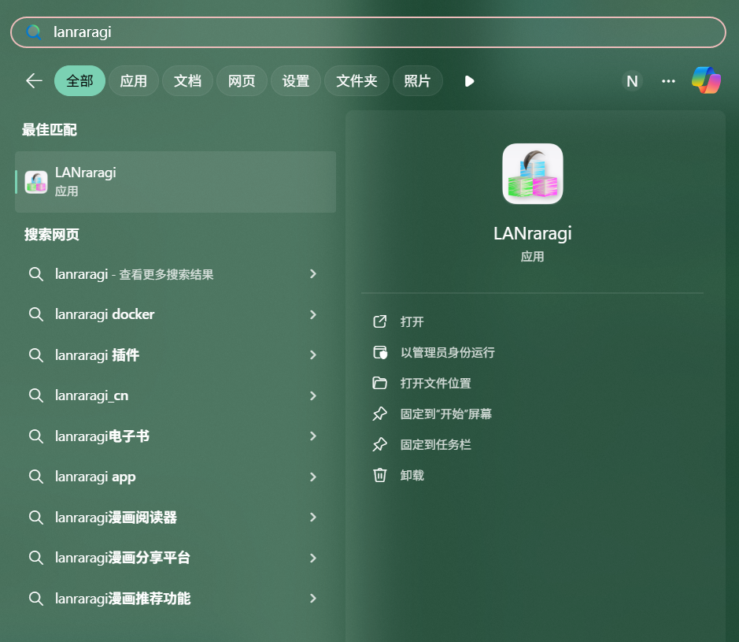
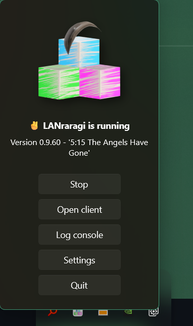

在`Settings`中设置好漫画存储路径和缩略图存储路径后（注意端口默认3000，检查是否被占用），通过`Open Client`访问网页即`http://localhost:3000`，`Log Console`可以查看日志。
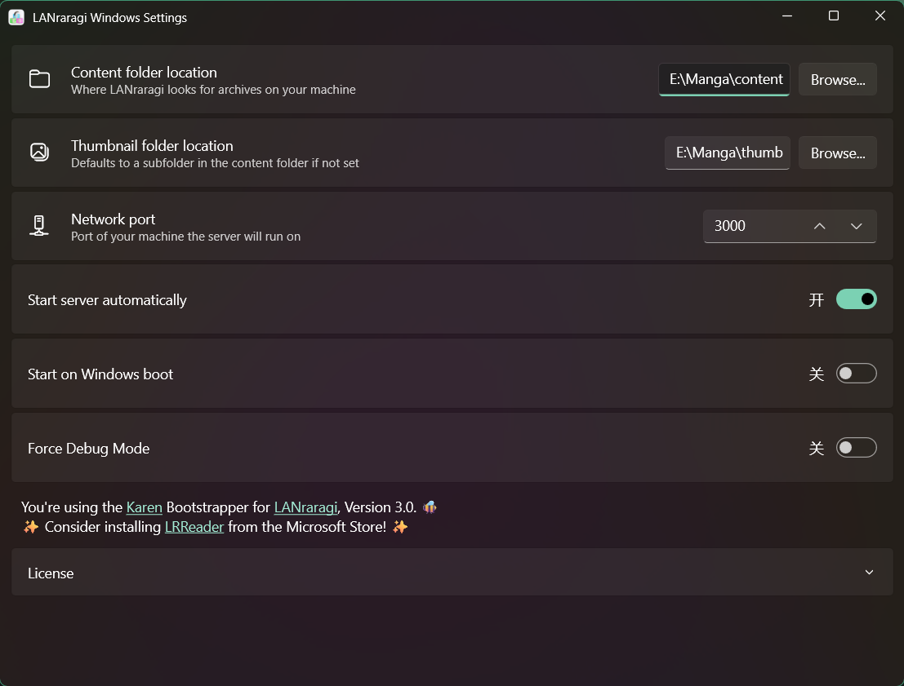

后续只要在所设置的`/content`目录存放漫画便可以在网页上看到啦。


但也可以在`添加档案`里手动上传:
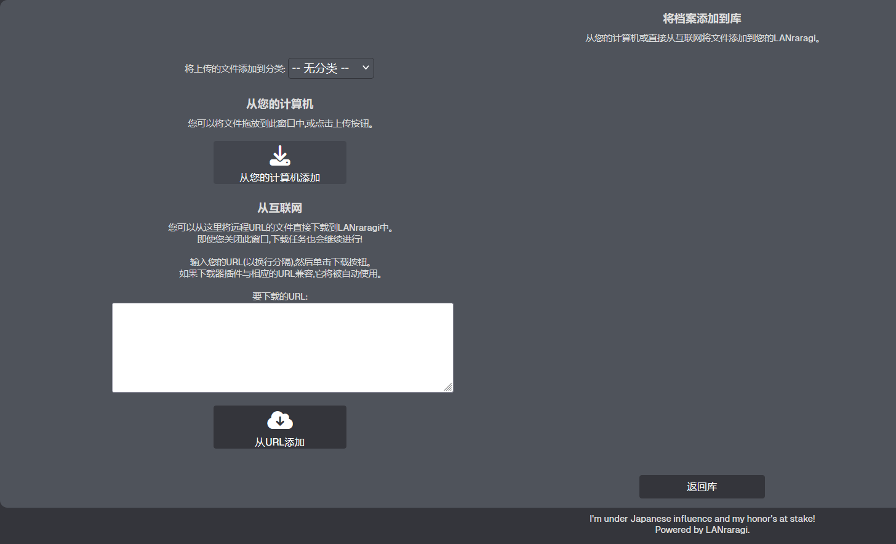

还有标签云功能也比较有意思：
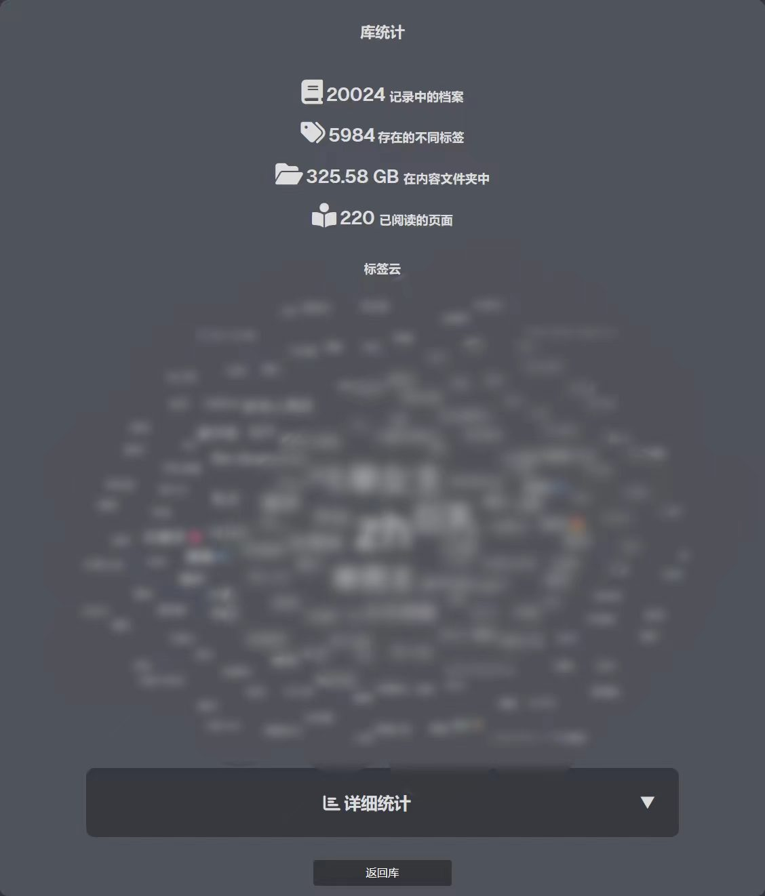

## Exhentai备份流程（元数据刮削）

### 事先准备（Tag Rules 翻译规则导入）

可以在这里下载我基于[EtagCN](https://github.com/zhy201810576/ETagCN)修改过的[Tag Rules](https://github.com/Nulovrsis/LANraragi-Plugins-Tag-Rules/raw/refs/heads/master/tags-20230428.txt)（**该Tag Rules也包含后续对于`nHentai`下载的本子的Tag翻译规则**），全选复制后粘贴在LANraragi设置中的`标签和缩略图`部分的`标签规则`中:


### 下载

下载主要在移动端进行，因为平时用移动设备刷本比较方便<span class="blur-text">（其实是在宿舍不方便用PC看）</span>。个人推荐彩E:
<a href="https://github.com/FooIbar/EhViewer"></a>
下载本子，注意`Ehviewer`中提供的下载属于爬虫，尽量日常轻量下载，使用时尽量将并发下载数设置低一些，同时设置好合适的下载延时，不然如果是未捐赠用户或者没解锁过Hath Perks中`More Pages`的账户，使用的跟随IP的5k点[`Image Limits`](https://github.com/ccloli/E-Hentai-Downloader/issues/298)则会一下就消耗完，导致IP被Ban，[关于此事的讨论见Issue](https://github.com/seven332/EhViewer/issues/350)，如果是想要备份收藏夹建议使用GP归档下载或者使用种子下载，同时在设置中打开"保存为CBZ压缩包"和"压缩包元数据"功能（便于后面`ComicInfo`插件直接离线提取元数据）。
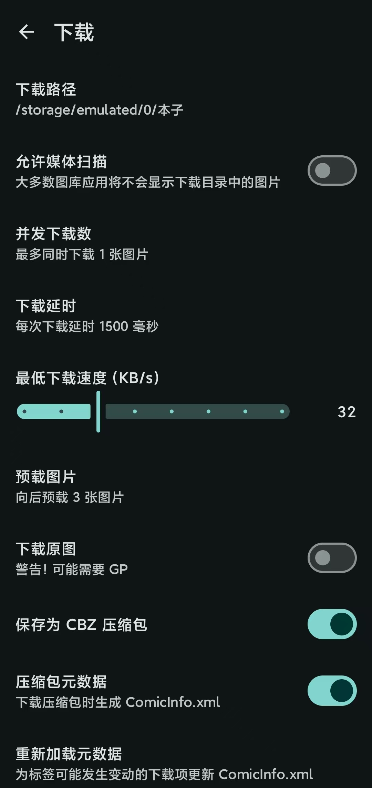

而元数据刮削主要是通过插件完成:`ComicInfo`(推荐)插件和`E-Hentai`插件:

### `ComicInfo`插件

在`LANraragi`的设置中的插件设置可以找到以下自带的元数据插件，这里建议勾选`允许插件替换档案标题`与`ComicInfo`插件的`自动运行`，该插件可以自动根据前文中`Ehviewer`下载得到的文件夹中的`ComicInfo.xml`文件提取出元数据。

> 注意Ehviewer下载的文件结构为:
>
> ```
> xxxxxxx-漫画标题(Folder)
> 	|_ xxxxxxx.cbz
> 	|_ ComicInfo.xml
> ```

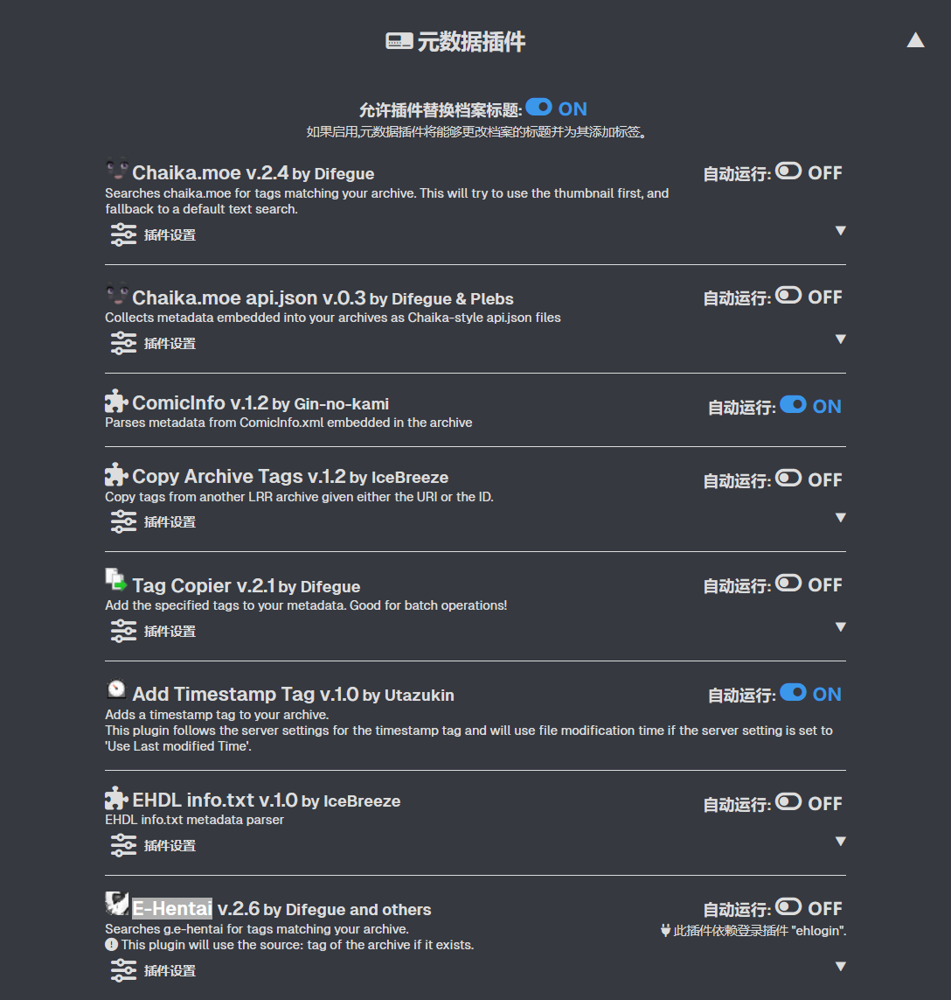

下载到`/content`的内容会被自动扫描，同时打开上图中的`自动运行`则至此能自动触发插件，同时设置里的tag rule会在保存元数据之前启用，实现将英文Tag翻译为中文，同时插件会修改文件名保证统一。

### `E-hentai`插件（可选）

如果有`ComicInfo`未能刮削到元数据的漫画，可以在`批量处理`中再使用`E-hentai`插件，该插件是根据标题爬取对应网页提取Tag，使用该插件需要开启代理软件的`Tun`模式或者设置好代理的环境变量，我这里则是配置了一个函数用于在启动lanraragi时为lanraragi提供暂时的代理环境变量（这样应该就不会影响到其他网络服务）:
在终端中输入:

```shell
notepad $PROFILE
```

在文件中输入并保存:

```powershell
function lanraragi {
    $env:http_proxy = "http://127.0.0.1:10808"
    $env:https_proxy = "http://127.0.0.1:10808" //这里填自己的代理软件端口
    Write-Host "代理已启用，启动 LANraragi 中..."
    Start-Process "E:\lanraragi\Karen.exe" //自行根据"Karen.exe"的路径修改
}
```

然后在批量操作页面即可批量刮削(尽量设置高一些的冷却时间防止ip被封禁):

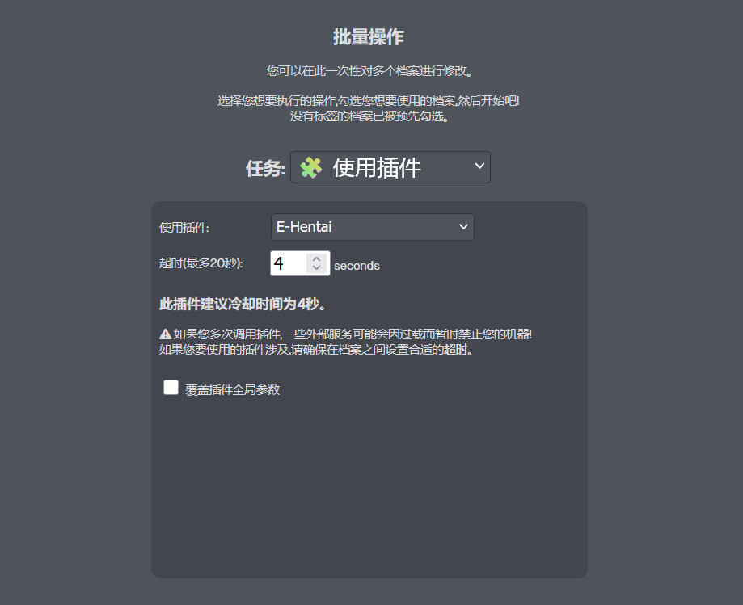

- PS:如果出现SSL报错或者各种网络问题也可以尝试修改此插件的源码,插件路径在`~\lanraragi\lib\LANraragi\Plugin\Metadata\EHentai.pm`,在里面添加针对`ua`代理的临时环境变量,其中的端口修改为自己的代理软件端口,我主要修改了一下两个部分，可以自行修改，也可以参考[我的仓库](https://github.com/Nulovrsis/LANraragi-Plugins-Tag-Rules)中的`.pm`文件,修改好自己的代理地址即可直接替换原版`.pm`插件使用。
  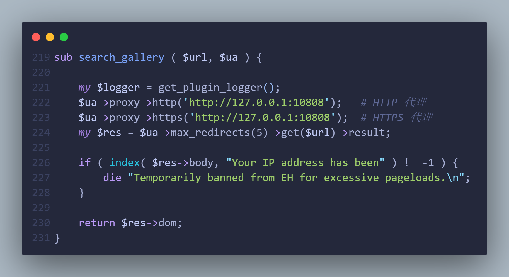

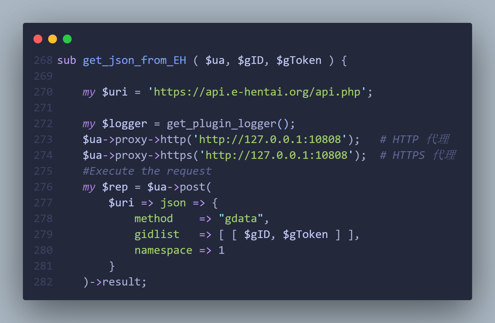

### nHentai（可选）

Nhentai（应对版权炮/同时便于对画师其他作品查漏补缺）
通过[nhentai](https://nhentai.net/)和[nHentai Helper插件](https://github.com/Tsuk1ko/nhentai-helper)，也可以下载含有Comicinfo.xml的.zip文件,区别只是.xml文件包含在压缩包中，导入lanraragi `/content`文件夹自动触发ComicInfo插件,同样也会利用Tag Rules翻译。

> 原本Nhentai的tag rule是不包含如"female : ..."这一项的所以我对EtagCN的tag rule（tags-20230428.txt）利用正则表达式去除了该部分，可以完美适应Nhentai的tag翻译工作,由于在`事先准备（Tag Rules 翻译规则导入）`部分详述过用法，此处不再赘述。

### 命名统一（可选）

如果你和我一样有点强迫症，会发现Ehviewer 中开启的ComicInfo功能 生成的`.xml`文件中没有Title这一项:使用的是`<Series>`和`<AlternateSeries>`前者一般是罗马，后者是日语假名。
因此导致在使用lanraragi的ComicInfo元数据插件时尽管开启了"允许插件修改档案标题"，依旧没有修改档案标题。所以处于修改的方便考虑（没有考虑维护，虽然平时lanraragi更新不会动刀pm插件部分），我修改了`ComicInfo.pm` 中传输`$title`的逻辑（全部使用假名作为标题）:

```perl
    $result = Mojo::DOM->new->xml(1)->parse($stringxml)->at('Title');
    if ( defined $result ) {
        $title = $result->text;
    }

    if( defined $title ) {
        # 如果已经有 Title，就不需要再覆盖了
    } else {
        # 优先使用 AlternateSeries
        $result = Mojo::DOM->new->xml(1)->parse($stringxml)->at('AlternateSeries');
        if ( defined $result ) {
            $title = $result->text;
        } else {
            # 如果没有 AlternateSeries，使用 Series
            $result = Mojo::DOM->new->xml(1)->parse($stringxml)->at('Series');
            if ( defined $result ) {
                $title = $result->text;
            }
        }
    }
```

> 因为平时几乎是在Exhentai下的资源均含有ComicInfo.xml文件，如果是补档资源(nhentai)，导入的过程中会因为没有`tag`而被容易被`batch option`识别，此时在`batch option`中使用Ehenatai插件批量刮削tag即可

### 更快的缩略图生成(可选)

通过阅读[v0.9.60 的ChangeLog](https://github.com/Difegue/LANraragi/releases/tag/v.0.9.60)可以发现，此次更新提供了新的缩略图生成与显示方案，之前使用的是`Image Magick`，现在可以下载[libvips](https://www.libvips.org/)，并在系统中添加环境变量，LRR即可使用该工具生成缩略图。

> 注意检查是否曾经下载过libvips，不然可能会有冲突，例如我之前使用`scoop`下载过，并且`scoop`自动将其添加至环境变量,导致我新手动下载的`libvips`没有被LRR正确识别调用。
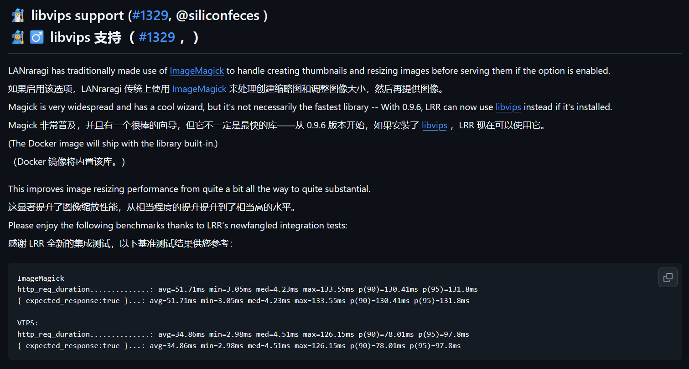

## 如何使用Mihon/Komikku中的LANraragi插件

通过漫画阅读开源软件Mihon/Komikku中的LANraragi插件可以实现随时随地在移动端观看备份的漫画
<a href="https://github.com/mihonapp/mihon"></a>
<a href="https://github.com/komikku-app/komikku"></a>

lanraragi插件使用方法:
在`设置` -`浏览`- `插件仓库`中导入:https://raw.githubusercontent.com/keiyoushi/extensions/repo/index.min.json
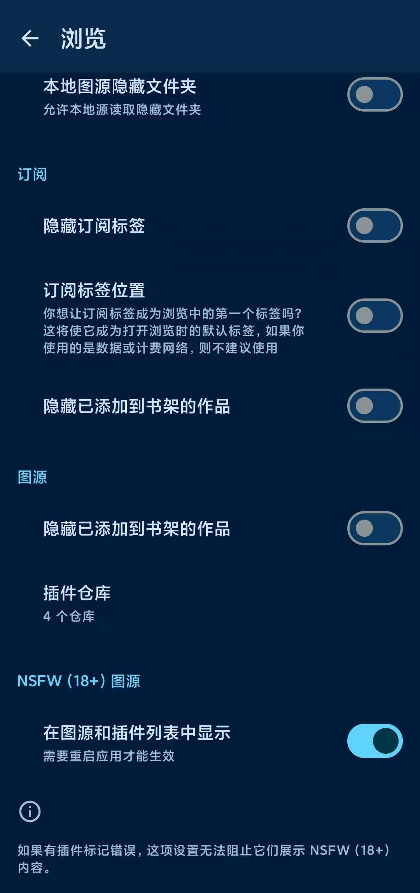
如图出现`Keiyoushi`仓库即可：
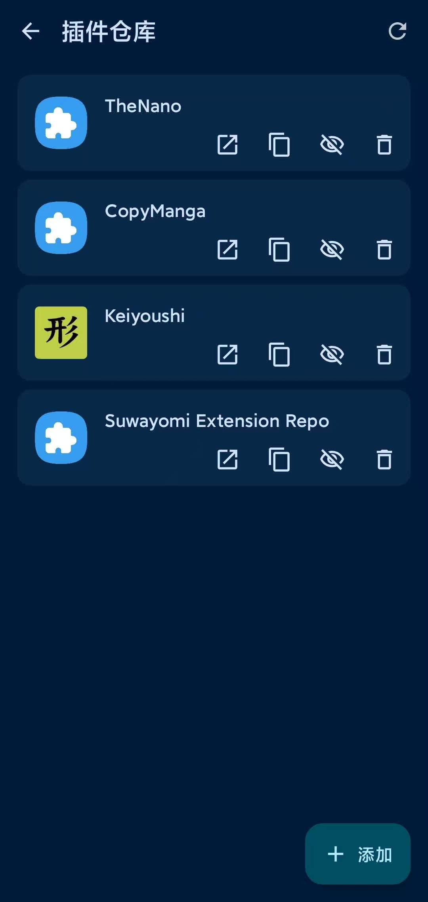
在`插件`页面搜索该插件下载安装后进入详情页：
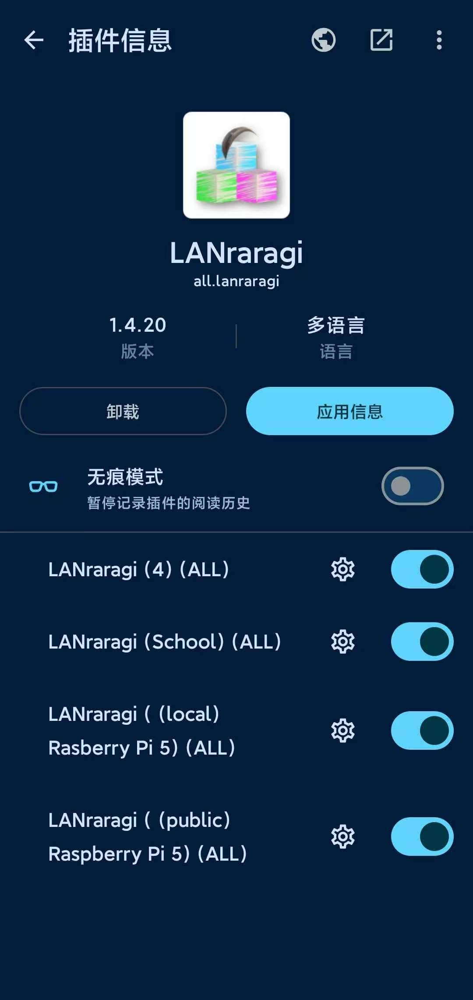
具体设置:`Hostname`填写`http://服务器公网ip:3000`(PC用户填写:`http://PC的IP:3000` PC的IP可以在命令行用`ipconfig`命令获取)
如果想要进一步保护隐私，可以在LANraragi设置中打开`No-Fun Mode`并设置好相应的API Key，在下图中填写好即可使用Mihon看LANraragi的漫画。(注意PC用户则需要保持电脑打开，运行LANraragi服务)。
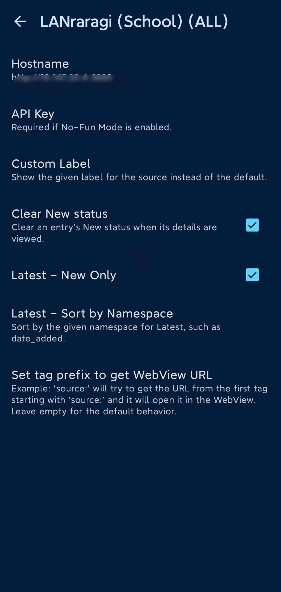

下面是关于长期E站使用的一些题外话：

## Ehentai货币与Ehviewer下载方式

[货币详解](https://github.com/kk9448/ehDonate/blob/main/e%E7%AB%99%E7%9A%843%E7%A7%8D%E8%B4%A7%E5%B8%81GP%2C%20C%2C%20Hath.md)

> 注: `Ehviewer`中的下载，是使用爬虫爬网页端端内容，并不是e站的正规下载方式，论坛甚至一部分用户认为ehv这种使用爬虫下载，大量占用了e站的资源，菠萝目前对爬虫下载是睁一只眼闭一只眼的态度，只对爬虫过量下载进行了限制。

### IP 封禁

这将导致全站无法访问。一般是因为 IP 流量太大或者抓取页面过于频繁导致风控。如果你是非捐赠用户并且使用公共代理，可能会更频繁地遇到此问题。

试试这些方法：

1.  成为捐赠用户是最直接的方法。
2.  如果不准备捐赠，建议至少开通 Hath Perks 中的 Multi-Page Viewer（多页查看器）权限，这会极大减少 HTML 页面的抓取。
3.  节约图片配额：
    - 分辨率建议选择自动或者 1280x，在移动设备上足够清晰且配额消耗较少
    - 在通用设置中关闭"阅读时自动缓存"
    - 对于页数多的图库，建议先用 Safari 归档下载，然后导入到对应图库中

### H@H

E站的一种pcdn项目，有能力有闲置服务器的也可以跑一跑[H@H](https://e-hentai.org/hentaiathome.php)，帮助E站减轻服务器压力。
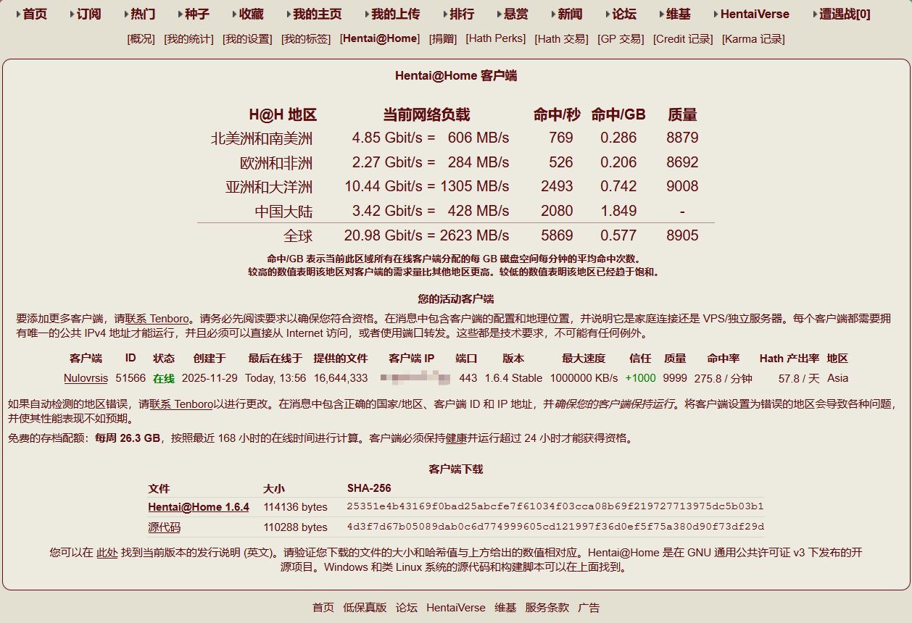
