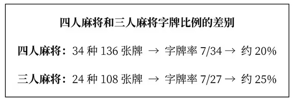
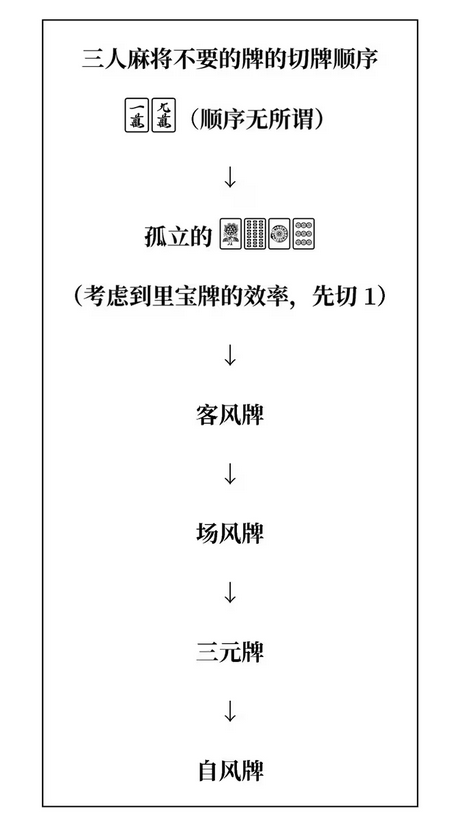
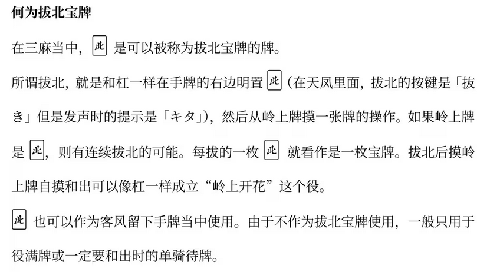
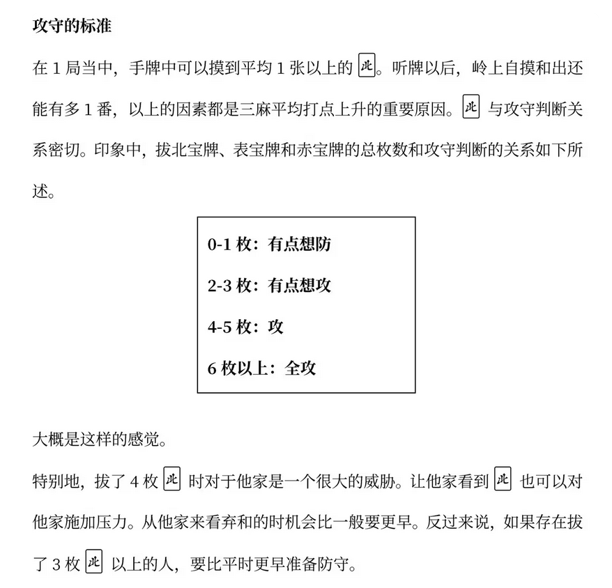
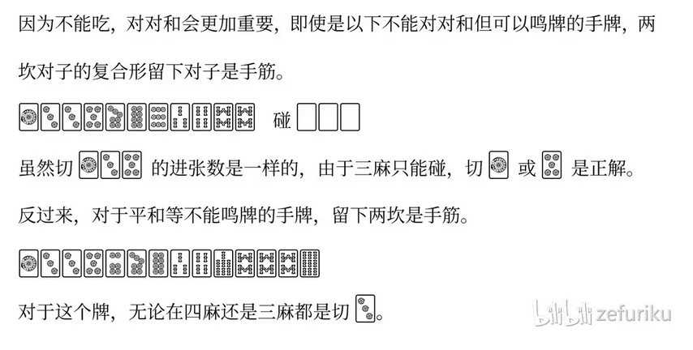
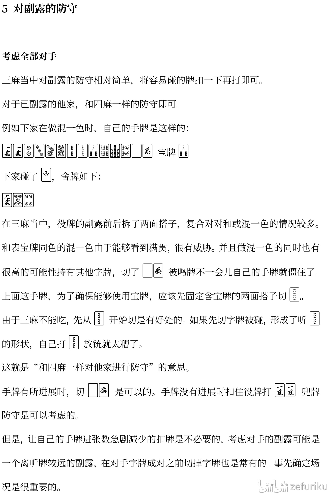
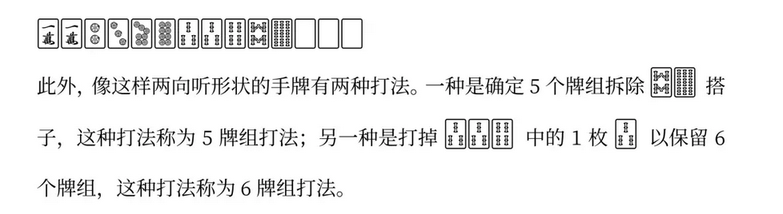

## 1 字牌重要性

扣住自排防止他家和出

### 切牌顺序

搭子足够,比起数牌 1,9 役牌价值更高

一九万价值最低 **主要是安全牌或者单骑听牌(等听雀头)**

- 场风先切:在东场东家先摸出一队东或者南场南家摸出一对南之前切出
- 自风后切:安全牌 or 役牌

> 注意此处先切非万字的1,因为手里同色一九时,九会因为作为一的里宝牌指示牌而使一作为宝牌改率降低

此图不一定,习惯上倾向于==先切客风==

## 2 高水平的技术介入程度

错过和牌

读牌精度

**序盘里筋，终盘边筋**理论重要度提升

里筋 早切1p 25p危险

边筋 晚切3p (之前保留了223/334 听14 25)

## 3 有关北风

三北:全拔比当面子好

拔北时机:即拔 积极拔北是基本战略 (下策是作为安全牌)

## 4 三人麻将没有三色

三麻核心役种:役牌和立直

三麻没有四麻那么看重手役 靠宝牌就能跟上打点

## 5 对副露的防守

**对于看起来要役牌的副露家想要进攻的话，孤张数牌和役牌中会优先打数牌**

## 6 对默听（碰听）的防守

大前提：没有拔北 不立直和副露的对手没有打点的场合较多 **没有必要牺牲手牌顾虑默听**

对手切两枚以上中张（2~8）一直摸切，很有可能听牌

## 7无筋的危险度

双无筋 456 比 123789 更危险，这是要更加注意的。

### 实战里的注意点

- 对手立直后，**456 这类中张无筋牌往往是危险牌**。
- 123/789 边张无筋则相对安全一些，但也不能掉以轻心。
- 如果是“双无筋”——比如某张牌既没有左边筋，也没有右边筋保护——那更要小心，尤其是中张。

对早巡立直扣住危险牌进行兜牌，立直后对手的牌河会减弱，能够只扣住对手的铳牌然后听牌的场合是很多的。

最好理解的是**拆对子和暗刻。**这是不会破坏手牌、向着听牌最有效的方法，可以说是兜牌的王道。

**没有字牌的对子或者暗刻并且手牌全是无筋的时候，代替字牌可以切 1 · 9 对子。（两端攻击）**

拆对子或暗刻优秀的原因是不会断开顺子的连接，并且如果能靠张成功，很容易能回到听牌如果安全地承受了 2 · 3 巡攻击，在这期间会生成新的安全区域。继续弃和也是可以的，或者依赖新的安全区域，打出一些好像可以通过的牌向着听牌前进，也是不错的打法。

防守中还想反攻的场合，**尽量不要打顺子中的牌。**不得不切顺子的场合也尽量从外侧先切。

形式听牌不重要四麻当中的形式听牌重要的原因是，相对于和牌点数，不听罚符一场有 3000 点，相对来比较高，并且四麻有着可以使用吃从而不打出危险牌来维持听牌的技术。另一方面，三麻不能吃，形式听牌相对难以形成，并且不听罚符一场只有 zooo点，相比于和牌点数较低。所以相对地，形式听牌的价值下降了。在三麻，切出危险牌而维持形式听牌的打法是没有的。

## 9 别拘泥于宝牌了

## 10 也别太拘泥于好形了

**手牌变化较少的以下宝牌 1 的边张听牌**，即立是基本。

## 11 遵循5牌组原则打三人麻将

6 牌组打法进张面更广的优点在牌种更多的四麻中更有利。在牌种少且容易摸进有效牌的三麻中，基本上应该要采取 5 牌组打法。
